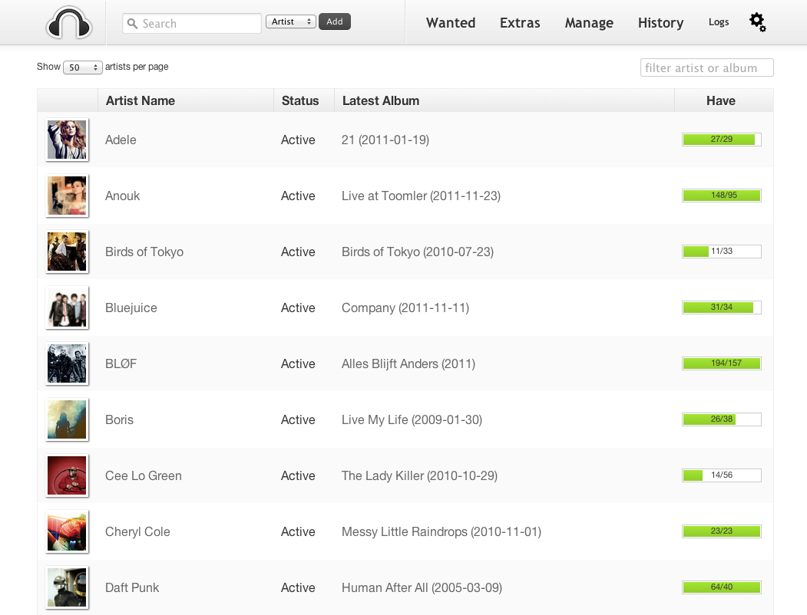

<!--
N.B.: This README was automatically generated by https://github.com/YunoHost/apps/tree/master/tools/README-generator
It shall NOT be edited by hand.
-->

# Headphones pour YunoHost

[](https://dash.yunohost.org/appci/app/headphones)  

[](https://install-app.yunohost.org/?app=headphones)

*[Read this readme in english.](./README.md)*

> *Ce package vous permet d’installer Headphones rapidement et simplement sur un serveur YunoHost.
Si vous n’avez pas YunoHost, regardez [ici](https://yunohost.org/#/install) pour savoir comment l’installer et en profiter.*

## Vue d’ensemble

Headphones is an automated music downloader for NZB and Torrent, written in Python. It supports SABnzbd, NZBget, Transmission, µTorrent, Deluge and Blackhole.


**Version incluse :** 0.6.1~ynh1

## Captures d’écran



## Documentations et ressources

* Documentation officielle utilisateur : <https://github.com/rembo10/headphones/wiki/Usage-guide>
* Dépôt de code officiel de l’app : <https://github.com/rembo10/headphones>
* YunoHost Store: <https://apps.yunohost.org/app/headphones>
* Signaler un bug : <https://github.com/YunoHost-Apps/headphones_ynh/issues>

## Informations pour les développeurs

Merci de faire vos pull request sur la [branche testing](https://github.com/YunoHost-Apps/headphones_ynh/tree/testing).

Pour essayer la branche testing, procédez comme suit.

``` bash
sudo yunohost app install https://github.com/YunoHost-Apps/headphones_ynh/tree/testing --debug
ou
sudo yunohost app upgrade headphones -u https://github.com/YunoHost-Apps/headphones_ynh/tree/testing --debug
```

**Plus d’infos sur le packaging d’applications :** <https://yunohost.org/packaging_apps>